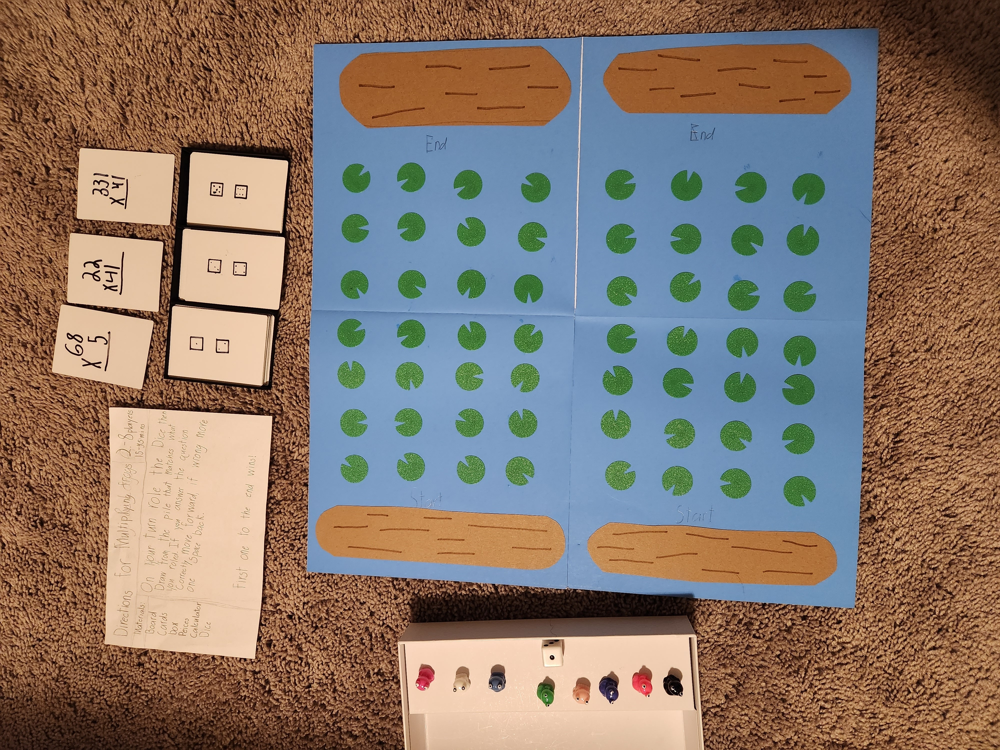

# Reference material

Source material for the port. Nothing on this page is a decision — it is the
**physical artifact** the design contract is derived from, kept here so a claim
about the game can be checked against the board rather than against somebody's
summary of it.

## The classroom game

Multiplying Frogs is a board game from Connor's math class. Everything in
`docs/specs/` describes a port of it, and
[ADR-0001](../../adr/0001-rules-sacred-presentation-ours.md) makes it the
authority on every rule.

*Photographed by Derek, 2026-08-08. Camera metadata stripped; the image is
otherwise unmodified.*

### The rules card, verbatim

> **Directions for Multiplying Frogs** — 2–8 players, 15–45 min
>
> **Materials:** Board, Cards, Box, Peices, Calculator, Dice
>
> On your turn role the Dice then draw from the pile that matches what you
> roled. If you answer the question correctly move forward. If wrong move one
> space back.
>
> **First one to the end wins!**

Spelling as written — it is handwritten, by a child or a teacher.

### What is in the photograph

| Component | What it is |
| --- | --- |
| **Board** | Folds down the middle. Each half holds four lanes of seven lily pads, running from a **Start log** to an **End log**. Eight lanes in total. |
| **Frogs** | Eight playing pieces, one colour each. One per player. |
| **Die** | **One**, six-sided, visible in the box. The rules card says "Dice"; three piles × two faces each accounts for exactly six faces. |
| **Card piles** | Three, each labelled with the two die faces that send you to it. |
| **Calculator** | Listed in the materials, for **checking** an answer rather than computing it. Paper is not listed because paper is ambient in a classroom. |

### The pile labels

Legible in the photograph at full resolution, and matching the sample card laid
beside each pile:

| Pile label | Roll | Problem shape | Sample card beside it |
| --- | --- | --- | --- |
| 2 pips, 1 pip | **1 or 2** | 2-digit × 1-digit | `68 × 5` |
| 4 pips, 3 pips | **3 or 4** | 2-digit × 2-digit | `22 × 41` |
| 6 pips, 5 pips | **5 or 6** | 3-digit × 2-digit | `331 × 41` |

Two faces per pile, so each difficulty comes up a uniform **⅓** of the time.
That distribution is what the problem generator has to reproduce.

## What the photograph does not settle

Tracked in
[issue #170](https://github.com/derekwinters/connor-multiplying-frogs/issues/170):

- Whether frogs are truly independent — one lane each, never sharing or
  interacting. Strongly implied by eight lanes and eight frogs.
- What happens on a wrong answer while on the Start log.
- Whether play continues after the first frog reaches the End log.

The full card deck is also not photographed. The game generates problems rather
than shipping the classroom deck, and the generator's constraints have to come
from the real cards —
[issue #171](https://github.com/derekwinters/connor-multiplying-frogs/issues/171).
